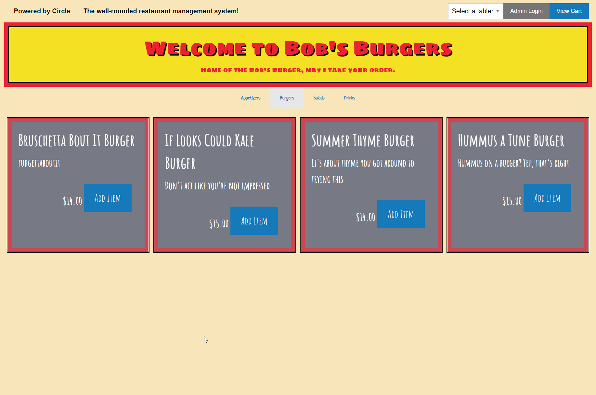

# Circle Restaurant Management [](https://opensource.org/licenses/MIT) 
###### This readme has been procedurally generated 

-----------------------
## Table of Contents
1. [Description](#description)
2. [Deployed link](#deployed-link)
3. [Installation](#installation)
4. [Usage](#usage)
5. [Code snippets](#code-snippets)
6. [Licenses](#licenses)
7. [Contributing](#contributing)
8. [Tests](#tests)
9. [Questions](#questions)

-----------------------
## Description
Circle is a full-stack, well rounded restaurant management application. It allows users, such as customers, to add items to their order while also facilitating restaurant administrative functions. On the administrative side this would include additional features such as adding, editing and deleting existing orders.

-----------------------
## Deployed link
[add heroku link here]

-----------------------
## Installation
To install dependencies run the following command:
```
npm install
```

-----------------------
## Usage
To use this repo you will need a working knowledge of Javascript, Express, Sequelize, Passport, HTML/Foundation CSS. 

To run this tool use the following command. 

```
node server.js
```

admin credentials: 
username: admin
password: password

-----------------------
## Code snippets

For our models, we had "Items" which holds all menu information, "Seating" which assigns users to a specific table for the food to be delivered, and "Orders" which is a join table between the two. Through table association Orders belongs to both Seating and Items with foreign-key's for each table allowing Orders to display itemId's correctly based on seatingId when Users are placing their orders.

```javascript
Orders.associate = function (models) {
		models.Orders.belongsTo(models.Seating, {
				foreignKey: {
						allowNull: false,
						constraints: false,
				}
		});
		models.Orders.belongsTo(models.Items, {
				foreignKey: {
						allowNull: false,
						constraints: false,
				}
		});
};
```

<!-- [Add comments here] -->

```javascript
app.get("/api/orders/seating/:id", function (req, res) {
		db.Orders.findAll({
				where: {
						SeatingId: req.params.id,
						submitted: 0,
						completed: 0
				},
				include: [
						{
								model: db.Items,
								required: false
						}
				]
		}).then(function (dbItem) {
				res.json(dbItem);
		})
});
```
To help align everything and make the menu items responsive, we added the following Foundation CSS. 

- 'grid-x': align all items in a row
- 'grid-margin-x': add a space along the x-axis
- 'small-up-2/medium-up-2/large-up-2": limit the number of menu items visible at various breakpoints.

```html
<div class="tabs-panel is-active" data-menu-items="appetizers" id="menuAppetizers">
	<div class="grid-x grid-margin-x small-up-2 medium-up-4 large-up-6" id="appetizerItem"></div>
	<!-- Dynamically add Menu Items by category through jQuery-->
</div>
```

-----------------------
## Licenses
This project uses a [MIT License](https://opensource.org/licenses/MIT). 

-----------------------
## Contributing
If you would like to contribute, you will need to know Sequelize and Node.

-----------------------
## Tests
To run tests run the following command:
```
NA
```

-----------------------
## Questions
Created by Hudson Barnes, Pamela Gutierrez, Michael Medina, Muhammad A Khalid

###### Pictured: Hudson Barnes, Pamela Gutierrez, Michael Medina, Muhammad A Khalid
<br>

If you have any questions you can reach us at the following: 

| | | | |
|-|-|-|-|
| Hudson Barnes  | [hudsonmbarnes@gmail.com](mailto:hudsonmbarnes@gmail.com)  |[LinkedIn](https://www.linkedin.com/in/hudson-barnes-398483151/) | [GitHub](https://github.com/hudsonmbarnes)  |
| Pamela Gutierrez  | [gtrz.pamela@gmail.com](mailto:gtrz.pamela@gmail.com)  |[LinkedIn](http://www.linkedin.com/in/pamela-gutierrez) | [GitHub](https://github.com/pamela-gutierrez)  |
| Michael Medina  | [michaelanthony.medinaa@gmail.com](mailto:michaelanthony.medinaa@gmail.com)  |[LinkedIn](https://www.linkedin.com/in/michaelanthonyy/) | [GitHub](https://github.com/michaelanthonyyy)  |
| Muhammad A Khalid  | [akhalid.code@gmail.com](mailto:akhalid.code@gmail.com)  |[LinkedIn](https://www.linkedin.com/in/abdullahkhalid/) | [GitHub](https://github.com/akhalid88/)  |